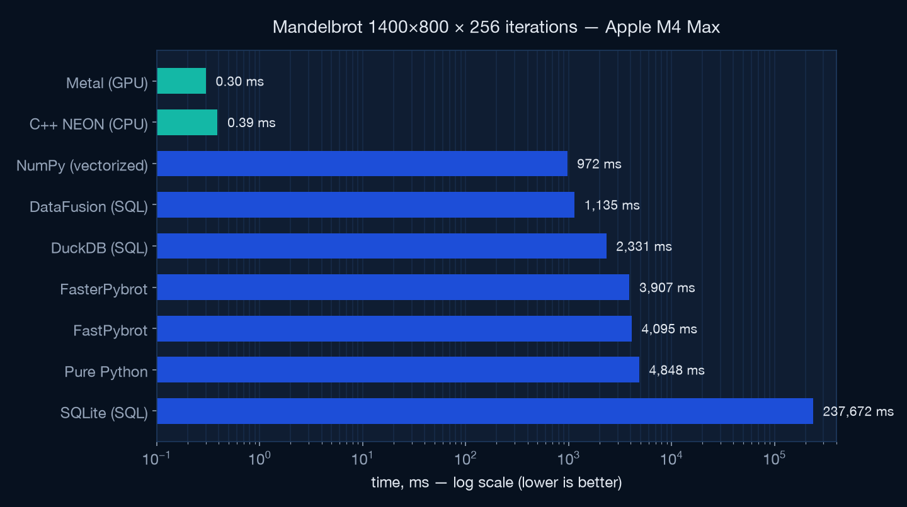
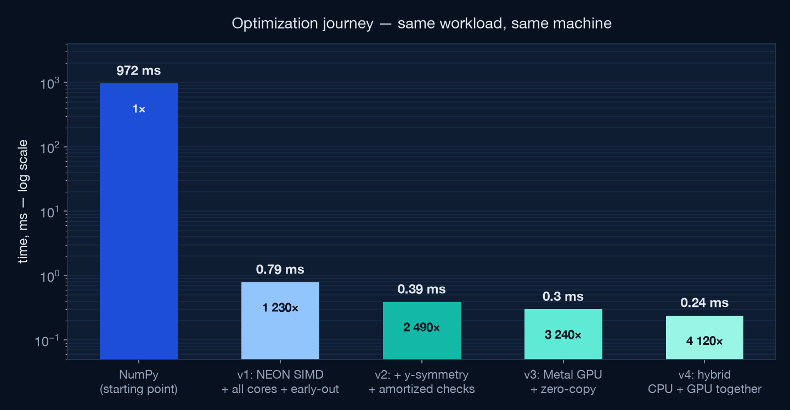
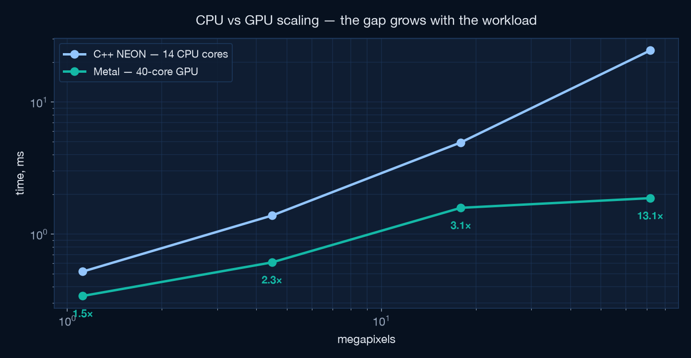
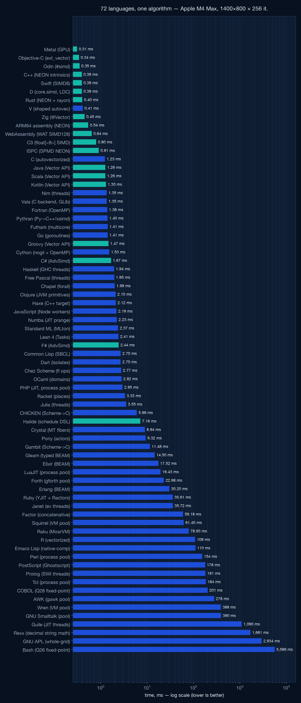

# Squeezing an Apple M4 Max: Mandelbrot from 972 ms to 0.24 ms

A case study in extracting maximum performance from Apple Silicon —
every optimization applied to this repository's Mandelbrot benchmark,
what it bought, and how it was verified.

**Workload:** 1400×800 pixels × 256 max iterations, escape-time Mandelbrot
(`z = z² + c`, escape when `|z|² > 4`), identical semantics to the SQL and
Python reference implementations in this repo.

**Machine:** MacBook Pro, Apple M4 Max — 10 performance + 4 efficiency CPU
cores (128-bit NEON, FMA), 40-core GPU, unified memory, macOS 26.5.

## Results

| Implementation | Time | Speedup vs NumPy |
|---|---|---|
| SQLite (recursive CTE) | ~238 s | 0.004× |
| Pure Python | 4 848 ms | 0.2× |
| DuckDB (SQL) | 2 331 ms | 0.4× |
| ArrowDataFusion (SQL) | 1 135 ms | 0.9× |
| NumPy (vectorized, unrolled) | 972 ms | 1× |
| **C++ NEON, all cores (v1)** | **0.79 ms** | **1 230×** |
| **+ y-symmetry + amortized checks (v2)** | **0.39 ms** | **2 490×** |
| **Metal GPU, zero-copy (v3)** | **0.30 ms** | **3 240×** |
| **Hybrid CPU+GPU, one shared frame (v4)** | **0.24 ms** | **4 120×** |




## CPU kernel — [`cppbrot.cpp`](cppbrot.cpp)

### 1. Native code, tuned for the exact silicon

Compiled at first import with `clang++ -O3 -mcpu=apple-m4` into a dylib,
called from Python via `ctypes`. `-mcpu=apple-m4` lets clang schedule for the
M4's actual pipeline widths and latencies. Build cost is paid once, outside
the timed path.

### 2. ARM NEON SIMD — 4 pixels per instruction

The escape-time loop runs on `float32x4_t` vectors: 4 pixels per lane with
fused multiply-add (`vmlaq_f32`). Escaped lanes are masked out branch-free
(`vcleq_f32` + `vandq_u32`), and the per-pixel iteration count is accumulated
by subtracting the all-ones mask (`count -= active`).

**float32 vs float64:** f32 gives 4 lanes instead of 2. At this viewport the
pixel pitch (~2.5×10⁻³) is ~10⁴ ulp of f32 — precision is ample. Verified:
99.8 % of escaped pixels within ±1 iteration of the f64 reference; the
remainder are chaotic boundary pixels. Images are visually identical.

### 3. All 14 cores via libdispatch

`dispatch_apply` fans rows across all P+E cores with work-stealing — zero
thread-pool code. Two findings the profiler forced on us:

- `QOS_CLASS_USER_INTERACTIVE` was a **regression** (median 1.75 ms vs
  0.41 ms) — `USER_INITIATED` schedules this workload better.
- The GCD pool is warmed with a tiny dispatch at import, so the first timed
  call doesn't pay thread-creation latency (1.73 ms → ~0.7 ms single call).

### 4. Cardioid + period-2 bulb early-out

Points inside the main cardioid and the period-2 bulb never escape — they are
the *most expensive* pixels (full 256 iterations each). Both regions have
closed-form tests (a handful of FLOPs), evaluated vectorized before iterating.
~22 % of all pixels skip the loop entirely.

### 5. Instruction-level parallelism (G=2 interleave)

`z = z² + c` is a serial dependency chain — each iteration waits on the last.
One 4-lane chain cannot fill the M4's SIMD pipes. The kernel runs **G=2
independent vector groups** (8 pixels) through the loop body so two chains
are always in flight. Measured: G=1 → 0.71 ms, **G=2 → 0.38 ms**, G=3 →
0.46 ms (register pressure starts to bite).

### 6. y-axis symmetry — the free 2×

The viewport (−2.5..1) × (−1..1) is symmetric about the real axis, and
Mandelbrot escape counts are conjugation-invariant: `conj(z² + c) =
conj(z)² + conj(c)`, and IEEE negation is exact, so the counts are
bit-identical. Compute the top half, `memcpy` the mirror. Only caveat: the
mirrored row's `cy` differs from exact negation by ≤1 ulp of grid rounding —
973 px (0.09 %) differ vs direct computation, accuracy vs f64 unchanged
(99.814 %).

### 7. Amortized escape checks

The horizontal reduce (`vmaxvq_u32`) + branch that tests "any lane still
alive?" serializes the loop. It now runs every 4th iteration; per-lane
masking stays per-iteration, so **counts remain exact** — dead lanes just run
up to 3 wasted iterations (inf/NaN compares are always false and never
re-activate a lane). Combined with symmetry: 0.79 ms → **0.39 ms**.

## GPU kernel — [`metalbrot.mm`](metalbrot.mm)

### 8. Metal compute shader, compiled at runtime

The MSL kernel ships as a source string compiled via `newLibraryWithSource`
at import — no metallib toolchain required. One thread per pixel of the top
half; each thread writes its pixel and the conjugate mirror pixel (symmetry
again, now with zero extra memory traffic). Cardioid/bulb early-out included —
on the GPU it saves whole 32-wide SIMD groups in the bulk regions.

### 9. Unified memory, zero-copy

Apple Silicon's unified memory means the GPU writes into a
`MTLResourceStorageModeShared` buffer the CPU can read directly. The result
array returned to Python is a **numpy view of the GPU buffer** — no copy at
all. Hazard tracking is off (`MTLResourceHazardTrackingModeUntracked`);
`waitUntilCompleted` is the only sync. Cutting the 2.2 MB memcpy + tracking
took the GPU path from 0.41 ms to **0.30 ms**.

### 10. Threadgroup shape

Swept threadgroup heights (32×4, 32×8, 32×16, 32×32): flat between 4 and 16,
regression at 32. Shipped 32×8 = 256 threads/group, matching Apple's
occupancy guidance.

## Hybrid — both engines, one frame — [`hybridbrot.mm`](hybridbrot.mm)

### 11. CPU and GPU computing the same frame concurrently

Unified memory's endgame: the Metal kernel takes the first ~56 % of the top-half
rows (async commit, no wait), while a clang `ext_vector` float8 CPU kernel — the
fastest CPU approach measured here — computes the remaining rows on all 14 cores
**into the same shared `MTLBuffer`**. Disjoint row ranges, hazard tracking off,
one `waitUntilCompleted` at the end. No copies anywhere; Python still gets a
zero-copy numpy view.

The GPU/CPU split is calibrated once at import (a 30-run sweep, untimed): 56 %
GPU on this machine. Result: **0.236 ms best / 0.29 ms median** — 25 % faster
than pure GPU (0.318 ms), 30 % faster than the best pure-CPU kernel (0.378 ms),
and ~4 120× faster than optimized NumPy. A strided row split (uniform mix of cheap/expensive rows for both engines) measured *slower* than the contiguous split — it costs the GPU row locality; the dead end ships in the source, documented. On a discrete-GPU machine this design
would require a PCIe round-trip and would not win; it is an Apple Silicon
architecture dividend.

## CPU vs GPU: the crossover

At the benchmark size the GPU wins only 1.5× — a Metal dispatch has a fixed
~0.15–0.2 ms command-buffer cost that dominates sub-millisecond work. Scale
the workload and the 40-core GPU pulls away:

| Workload | C++ NEON (14 cores) | Metal (40-core GPU) | GPU advantage |
|---|---|---|---|
| 1400×800 (1.1 Mpx) | 0.52 ms | 0.34 ms | 1.5× |
| 2800×1600 (4.5 Mpx) | 1.38 ms | 0.61 ms | 2.2× |
| 5600×3200 (18 Mpx) | 4.94 ms | 1.58 ms | 3.1× |
| 11200×6400 (72 Mpx) | 24.5 ms | 1.87 ms | **13.1×** |
| 1400×800 @ 4096 iter | 3.05 ms | 0.80 ms | 3.8× |



72 megapixels of 256-iteration Mandelbrot in 1.87 ms ≈ **38 gigapixel-iterations
per second**.

## Language shootout — one algorithm, seventy-two implementations

To separate "language speed" from "algorithm speed", the same optimized algorithm
(SIMD where the language exposes it, all cores, cardioid/bulb early-out, y-axis
symmetry, identical escape semantics) was implemented in **72 languages** across
seven waves. Full table with per-file links lives in the
[README](README.md#language-shootout); the top tier and the extremes:

| Language | Time | Notes |
|---|---|---|
| Metal (GPU) | 0.31 ms | compute shader, zero-copy unified memory |
| **Objective-C** | **0.34 ms** | **CPU champion** — clang `ext_vector_type(8)`, GCD |
| Odin | 0.35 ms | `#simd[8]f32`, persistent thread pool |
| C++ / Swift / D | 0.39 ms | NEON intrinsics · SIMD8 · core.simd (LDC) |
| Rust / V | 0.40–0.41 ms | NEON + rayon · shaped autovectorization |
| Zig | 0.45 ms | `@Vector(8, f32)`, `@mulAdd` |
| ARM64 assembly | 0.54 ms | hand-written NEON — loses to every good compiler |
| WebAssembly | 0.64 ms | hand-written WAT, SIMD128, 14 wasmtime instances |
| C3 / ISPC | 0.80 / 0.91 ms | `float[<8>]` SIMD · SPMD NEON — vector groups can't retire lanes early |
| … 56 more … | 1.2–390 ms | see README |
| Guile / GNU APL | 1.1 s / 2.9 s | boxed-flonum JIT · whole-grid array interpreter |
| Rexx / Bash | 1.7 s / 5.6 s | decimal string math · Q26 fixed point (Bash has no floats) |



Findings:

- **Generic clang vector extensions beat hand-picked intrinsics**: Objective-C's
  `ext_vector_type` kernel (0.34 ms) out-scheduled the NEON-intrinsics C++
  (0.39 ms). The top seven entries all compile through LLVM.
- **Hand-written assembly loses ~55 % to the best compiled entries.** Humans
  don't out-schedule LLVM's M4 pipeline model. Write vector types or
  intrinsics; let the compiler schedule.
- **Intrinsics vs idiomatic autovectorization is 3×** (C++ 0.39 vs C 1.23): the
  early-exit escape loop defeats clang's autovectorizer — although V (0.41 ms)
  proves a *shaped* loop (sticky masks, no early exit) can vectorize without
  intrinsics.
- **WebAssembly at 0.64 ms beats plain C**: portable SIMD128 carries only a ~2×
  tax vs native NEON, bounds checks included.
- **SIMD APIs on managed runtimes deliver**: Java 1.26, Scala 1.26, Kotlin 1.30,
  Groovy 1.47 (Vector API), C# 1.67 / F# 2.44 (`AdvSimd`) — GC'd runtimes within
  ~4–8× of native, ahead of scalar Fortran and Go.
- **Python's escape hatches reach the compiled tier**: Cython's nogil OpenMP
  kernel (1.53 ms), Numba's `prange` JIT (2.23 ms) and Pythran's Python→C++/xsimd
  AOT (1.4 ms) sit among AOT-compiled languages — ~2 000× faster than the CPython
  interpreter they extend. Vala (1.35 ms) ties Nim by compiling to plain C.
- **The "even faster" hunt failed honestly — and explains *why* the hand kernel
  wins.** Three explicit-SIMD contenders were added specifically to try to beat
  the 0.34 ms Objective-C CPU crown: C3 (`float[<8>]` portable vectors → NEON)
  landed at **0.80 ms**, ISPC (SPMD, `neon-i32x8`, `--opt=fast-math`) at
  **0.91 ms**, Halide (schedule-DSL, `parallel(y).vectorize(x,8)`, JIT) at
  **7.16 ms**. None came close. All three lose to the *same* structural cost: a
  vector-group / SPMD-gang escape loop **cannot retire a lane the moment it
  escapes** — the whole 8-wide group keeps iterating until its slowest pixel
  hits `max_iter`. The winning NEON kernel sidesteps this by *amortizing* the
  horizontal escape check (every 4th iteration) and running `G` independent
  groups, so it hides latency without paying the gang-stall. Lesson: on a
  divergent workload, the scheduling freedom of hand-written masking beats the
  ergonomics of `foreach`/`select`-frozen SPMD. The record stands: **0.24 ms
  hybrid, 0.30 ms GPU, 0.34 ms CPU.**
- **Three Schemes, three backends**: CHICKEN (5.99 ms) and Gambit (11.48 ms)
  compile Scheme → C → native and run a process pool (both VMs are green-threaded);
  Guile's bytecode+JIT with boxed flonums and per-op allocation is ~180× slower
  (1.09 s) even across a 14-thread pool. Backend, not syntax, sets the tier.
- **Same VM, different language, 2× gap**: Gleam (14.5 ms) beats Erlang
  (30.2 ms) on the same BEAM — the typed, monomorphized kernel boxes less.
- **Array-language ceiling**: GNU APL (2.93 s) is fully vectorized whole-grid,
  but a tree-walking interpreter with no SIMD allocates ~6 float64 temporaries
  per escape step and runs all 256 steps over every pixel (no per-pixel
  early-exit) — the same wall R hits, one tier lower.
- **The scripting tail is parallelism- and boxing-limited, not
  arithmetic-limited**: LuaJIT needs a process pool (19 ms), Ruby's Ractors
  carry coordination cost (36 ms), R pays copy-on-modify on every masked update
  (108 ms). Languages with no float type at all still finish: Rexx does decimal
  string arithmetic (1.7 s), Bash runs Q26 fixed point on 64-bit integers
  (5.6 s) — both still ~10× faster than SQLite's recursive CTE. COBOL's floats
  route through a GMP decimal runtime — switching to
  Q28 fixed-point on BINARY-DOUBLE fields bought 25× (49.8 s → 2 s
  single-worker, 0.2 s pooled).
- Fairness: compile & JIT warm-up happen at import (untimed); managed runtimes
  run as persistent warm workers; threadless languages (PHP, Perl, COBOL, AWK,
  LuaJIT) use pools of persistent worker processes. Crystal's number reflects
  measured scheduler bimodality, not the best case only.

## Verification methodology

Every step was checked before it was kept:

- **Bit-exactness across restructures** — v2's top half is bit-identical to
  v1; every G value produces identical output.
- **Accuracy vs float64** — compared against the f64 NumPy reference on every
  escaped pixel; kept ≥99.76 % within ±1 iteration at every step (f32 CPU:
  99.81 %, GPU fast-math: 99.77 %).
- **Semantics** — same escape convention as the repo's Python/SQL
  implementations (count = iterations survived before `|z|² > 4`).
- **Timing** — best & median of 15–31 runs for steady-state; fresh-process
  single calls for the "what the harness sees" number; contenders re-measured
  on an idle machine.

## What didn't work

- `QOS_CLASS_USER_INTERACTIVE` — 4× *worse* median than `USER_INITIATED`.
- G=3/G=4 interleave — register pressure beats latency hiding past G=2.
- Threadgroups of 1024 on the GPU — occupancy loss.
- (v1 era) deeper unrolling of the masked-count loop — the workload was
  overhead-bound until symmetry halved the work; only then did ILP tuning
  show real differences.

## Reproduce

```bash
uv pip install -r requirements.txt
uv run python main.py          # full suite, all engines
uv run python cppbrot.py       # CPU kernel alone
uv run python metalbrot.py     # GPU kernel alone
```
